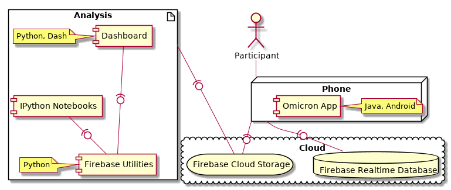

# Omicron
An Android app aimed for research on Mobile Information Retrieval. Developed at Università della Svizzera italiana (USI), Lugano, Switzerland.

## Requirements

This application need a [Firebase account](https://firebase.google.com/) to work.

An account for Crashanalytics is needed for Crash Analytics reporting

Qualtrics is used for the questionnaires. The link for the questionnaires are in MainActivity (openSurvey, onStartTask, OpenPostTaskQuestionnaire).
TaskBrowserActivity uses an interceptor to know when the user has finished a questionnaire, the url that Qualtrics use might change in the future. 

A [Bing Web Search API](https://azure.microsoft.com/en-us/services/cognitive-services/bing-web-search-api/) subscription is needed to use web search capabilities 
The key need to be set in Configuration.java BING_KEY

## Usage

This application can be used for task-based user studies in mobile IR.
 
Sensors data from participants' smartphones are collected for the duration of a study. The collected data
is routinely uploaded to the cloud (Firebase Storage) for easy access and analysis.

Tasks can be scheduled in advance and participants are informed by a notification 
 

## Enable/Disable Sensors

To enable/disable the gathering of a sensor edit Configuration.java:

Add the constant of the sensor to the array to send collected data on Wifi networks
 
__filesNamesList__

If the data need to be uploaded using mobile data are available add it also to

__lightFilesNamesList__

To stop the gathering of a sensor set the corresponding flag to false.

## Tasks

Tasks need to be defined in the Firebase Realtime database.

The structure of the database need to be the following:

- The first node is the appid of the user that can be retrieved from the application
-  "tasks"
- YYYY-MM-DD (date)
- task-id (can be choose freely but must be unique)
- the task

The structure of a task is the following:

- description text 
- title text
- windowStart : hour e.g. 16
- windowEnd : hour e.g. 18 (the extreme is not included)
- done: initially false
- doneTimestamp/startTimestamp: initially -1

## Notification

Users can delay a task and it's reissued in the next time slot or it is piggybacked at the end of another task if in the next slot is already occupied by a task.

